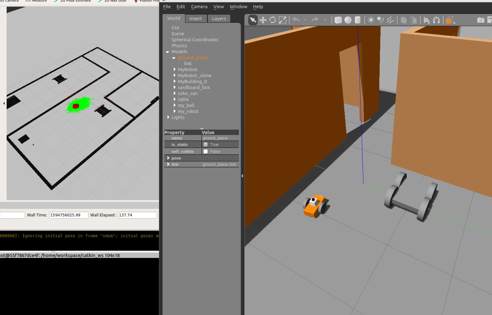

# Project3
Project: Where Am I

Steps in this project
* Use pgm_map_creator package to generate a map from Gazebo world.
* Add a launch file for map_server, AMCL and move_base
* Optional: Tune AMCL parameter 

### Directory structure
    ├── my_robot                       # my_robot package                   
    │   ├── launch                     # launch folder for launch files   
    │   │   ├── robot_description.launch
    │   │   ├── world.launch
    │   ├── meshes                     # meshes folder for sensors
    │   │   ├── hokuyo.dae
    │   ├── urdf                       # urdf folder for xarco files
    │   │   ├── my_robot.gazebo
    │   │   ├── my_robot.xacro
    │   ├── world                      # world folder for world files
    │   │   ├── <yourworld>.world
    │   ├── CMakeLists.txt             # compiler instructions
    │   ├── package.xml                # package info
    ├── ball_chaser                    # ball_chaser package                   
    │   ├── launch                     # launch folder for launch files   
    │   │   ├── ball_chaser.launch
    │   ├── src                        # source folder for C++ scripts
    │   │   ├── drive_bot.cpp
    │   │   ├── process_images.cpp
    │   ├── srv                        # service folder for ROS services
    │   │   ├── DriveToTarget.srv
    │   ├── CMakeLists.txt             # compiler instructions
    │   ├── package.xml                # package info                  
    └──             