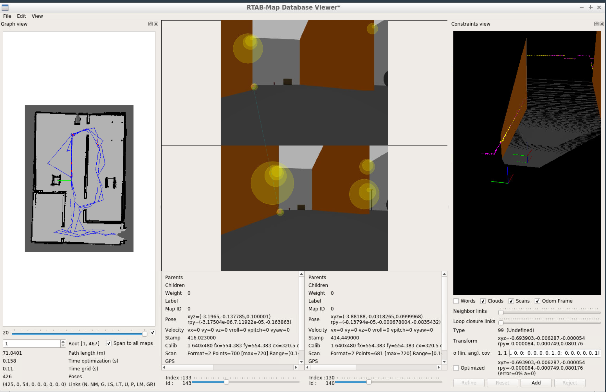

# Project4
Project: Map My World

**Need to clone the following package under src:**
* [Teleop_twist_keyboard](http://wiki.ros.org/teleop_twist_keyboard)

Steps in this project:
* Adjust the RGBD sensor for 2D laser scan
* Add RTAB-MAP package
* Manually move the robot around in the map by Teleop Package
* View the RTAB-MAP by database viewer
* Use RTAB-MAP package for localization by changing the mapping of in parameters

