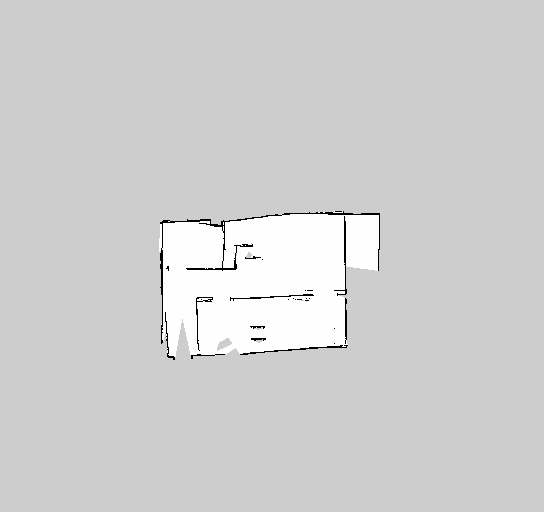
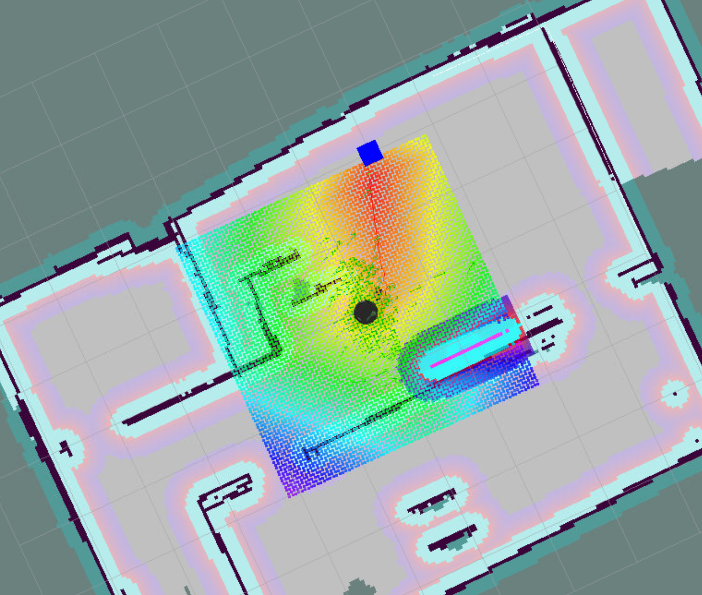
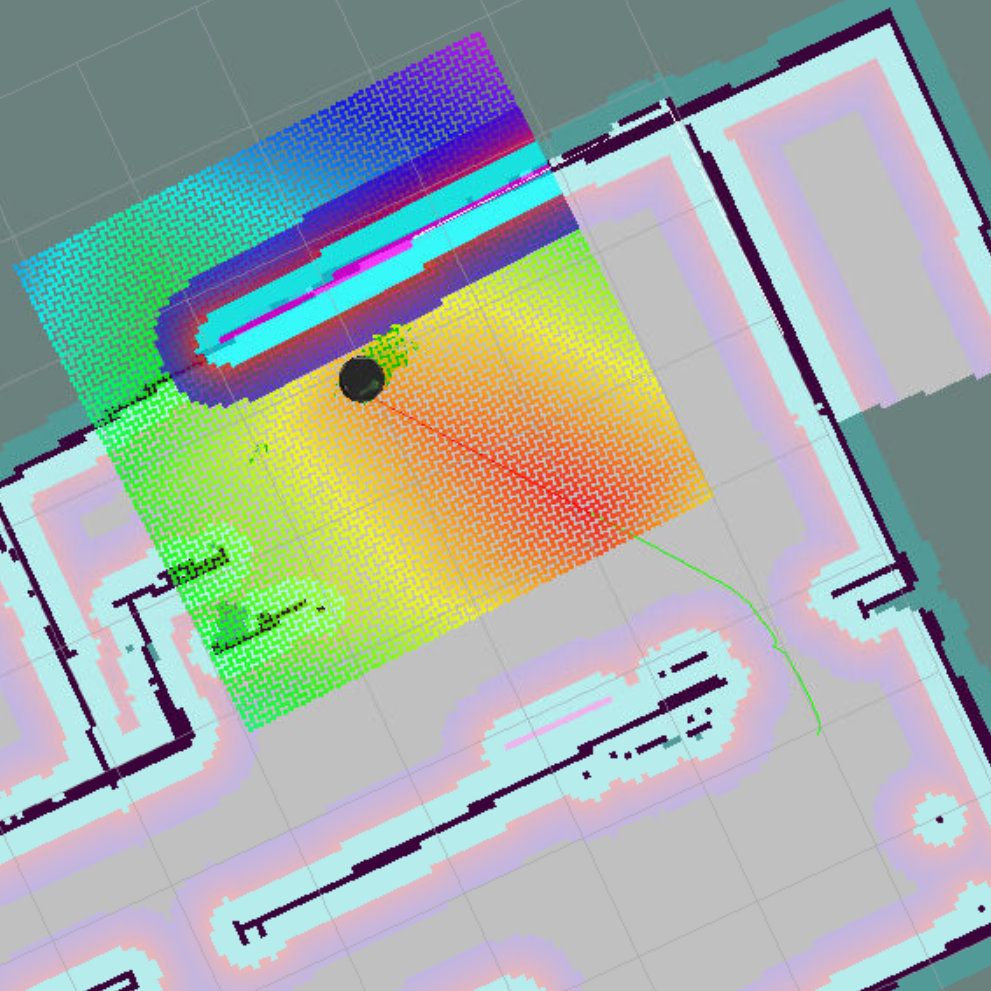
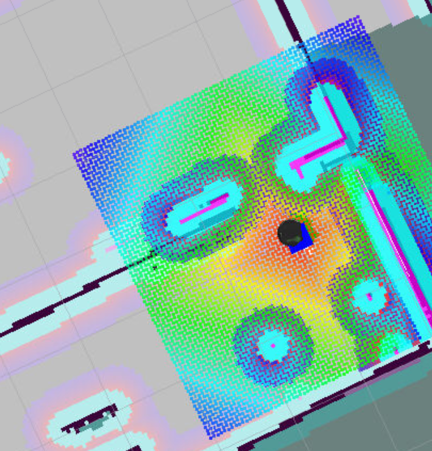

# Project5
Project:Home Service Robot

**Note: Absolute paths being used in scripts. Need to change the path according to the working environment**

Steps in this project
* Launch World,Gmapping and teleop to generate a map for the environment (test_slam.sh)
* Test Navigation packages 
* Add pick_objects to simulate home service robot task (pick_objects.sh)

* Add add_marker to label robot target in rivz. Add marker demo as (add_markers.sh)
* Combine pick_objects and add_markers to simulate and visualize the home service task.

### Directory Structure
    src
    ├──                                # Official ROS packages
    |
    ├── slam_gmapping                  # gmapping_demo.launch file                   
    │   ├── gmapping
    │   ├── ...
    ├── turtlebot                      # keyboard_teleop.launch file
    │   ├── turtlebot_teleop
    │   ├── ...
    ├── turtlebot_interactions         # view_navigation.launch file      
    │   ├── turtlebot_rviz_launchers
    │   ├── ...
    ├── turtlebot_simulator            # turtlebot_world.launch file 
    │   ├── turtlebot_gazebo
    │   ├── ...
    ├──                                # Your packages and direcotries
    |
    ├── map                          # map files
    │   ├── ...
    ├── scripts                   # shell scripts files
    │   ├── ...
    ├──rvizConfig                      # rviz configuration files
    │   ├── ...
    ├──pick_objects                    # pick_objects C++ node
    │   ├── src/pick_objects.cpp
    │   ├── ...
    ├──add_markers                     # add_marker C++ node
    │   ├── src/add_markers.cpp
    │   ├── ...
    └──