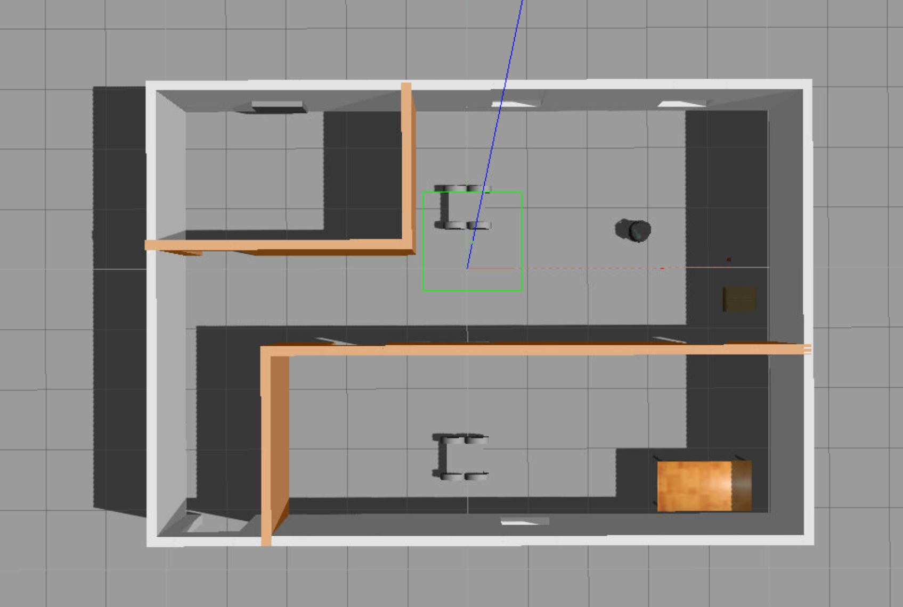

# Project: Home Service Robot

**Note: scripts in the workspace may need ($pip install rospkg) before use**

**Note: map and world are specified by absolute path in script files**


# Localization

The localization of this project uses AMCL package.

# Mapping
A map is generated by the SLAM testing (/scripts/test_slam.sh).

```
//Note: Save the pgm and yaml file by the following command
rosrun map_server map_saver -f myMap
```

The SLAM packaged being used in this project is gmapping. The map is generated by manually move turtlebot around in the gazebo world.




# Navigation

Navigation is done by the ROS Navigation Stack.


# Home Service 

The add_marker and pick_objects communicate the robot status via a global ros parameter.

After the robot reached the pick_up zone, the pick_objects node will set change parameter and the add_marker will reacts to the change.